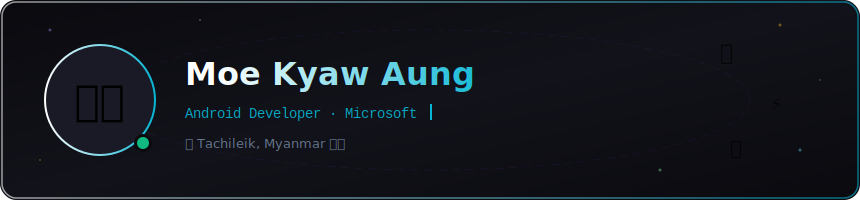

<div align="center">

<!-- ═══ ANIMATED HEADER BANNER ═══ -->
[](https://github.com/moekyawaung)

<!-- ═══ TYPING ANIMATION ═══ -->
[](https://git.io/typing-svg)

<!-- ═══ PROFILE VIEWS + FOLLOWERS ═══ -->


</div>

---

## 🙋‍♂️ About Me

```kotlin
val moeKyawAung = Developer(
    name     = "Moe Kyaw Aung",
    role     = "Android Developer @ Microsoft",
    location = "Tachileik, Myanmar 🇲🇲",
    focus    = listOf("Clean Architecture", "Jetpack Compose", "Great UX"),
    learning = listOf("MVVM", "Unit Testing", "App Performance"),
    hobbies  = listOf("Computer Vision 👁️", "Cybersecurity 🔐", "Web Tech 🌐")
)
```

> 🔑 Nearly **two years** of experience building reliable, secure, and user‑friendly Android apps.  
> I enjoy solving real‑world problems with modern tools and a strong focus on UX.

---

## 🔧 Tech Stack

<!-- ═══ SKILL ICONS ═══ -->
<div align="center">

### 📱 Mobile & Languages
[](https://skillicons.dev)

### ☁️ Backend & Cloud
[](https://skillicons.dev)

</div>

| Category | Technologies |
|---|---|
| **Languages** |    |
| **Android** |    |
| **Backend** |    |
| **Tools** |    |

---

## 📱 Android Projects

### 🌐 API‑Driven Apps
> Weather, news & content apps with Retrofit/OkHttp — caching, error handling, pagination
  

### 📴 Offline‑First Apps
> To‑do, notes & habit trackers — Room DB, repository pattern, MVVM
  

### ☁️ Cloud‑Connected Apps
> Firebase auth, real‑time sync, and push notifications
  

### 📷 Utility & Device Features
> Camera, QR/barcode scanning, location/maps, sensor tools
  

### 🎨 UI/UX‑Focused Demos
> Material Design, animations, dark mode, accessibility
  

> 🔗 **Check out my pinned repositories below for examples, code structure & UI samples.**

---

## 📊 GitHub Stats

<div align="center">

<!-- Stats Card -->


<!-- Top Languages -->


</div>

<!-- ═══ STREAK STATS ═══ -->
<div align="center">

[](https://git.io/streak-stats)

</div>

---

## 🎓 Learning & Certifications

| Area | Status |
|---|---|
| 💻 Software Development Fundamentals | ✅ Certified |
| 👁️ Computer Vision with Python | ✅ Certified |
| 🔐 Cybersecurity & Secure Coding | ✅ Certified |
| 📈 Web Technologies & Digital Growth | ✅ Certified |
| ✨ Jetpack Compose — Modern UI | 🔄 In Progress |

---

## 🚀 Currently Focusing On

```
🎯  01  →  Jetpack Compose + Modern Android Architecture (MVVM, Clean)
⚡  02  →  App Performance, Offline-First Patterns & Testing
🏆  03  →  Production-Ready Apps with Outstanding UX
```

---

## 🌐 Connect

<div align="center">

[](https://github.com/moekyawaung)
[](https://linkedin.com/in/moekyawaung)
[](mailto:moekyawaung@gmail.com)

</div>

---

<div align="center">

<!-- ═══ FOOTER WAVE ═══ -->
[](https://github.com/moekyawaung)

*Made with ❤️ in Tachileik, Myanmar 🇲🇲*

</div>
